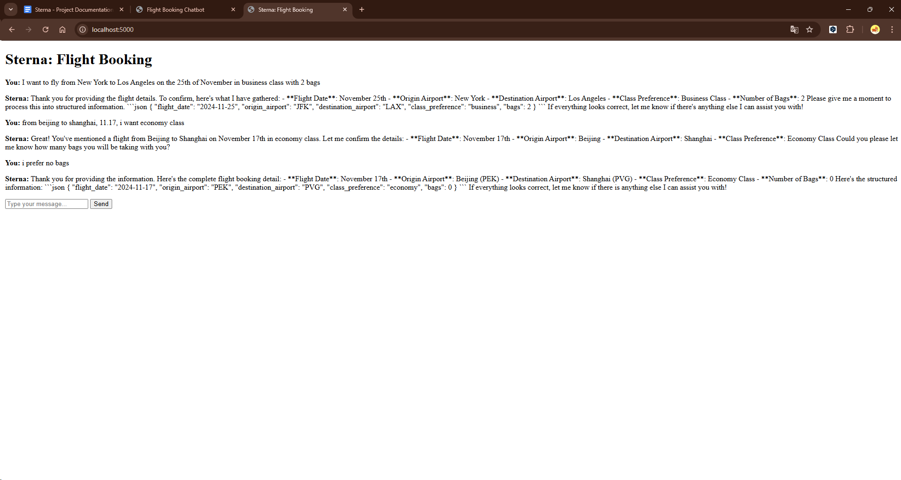

Sterna_v0.0
---

## Introduction
This is the initial version of **Sterna_v0.0**, developed using Agile software development practices. It integrates the OpenAI API with Flask as the backend and includes a very simple front-end. This version is compatible with:

- OpenAI Integration  
- Input Normalization  
- Multiple Input Handling  
- JSON-formatted Final Output  

## Prerequisites
Ensure you have the following installed:

- Python 3.9  
- Flask 2.2.5  
- OpenAI Python library  

To install the required dependencies, run:
```bash
pip install python==3.9  
pip install flask==2.2.5  
pip install openai
```

Alternatively, you can use the `.venv` library provided in the repository.

## Usage
1. Open a terminal and navigate to the project root directory.
2. Start the application by running:
   ```bash
   flask run
   ```
3. Open your browser and go to:  
   - [http://127.0.0.1:5000/](http://127.0.0.1:5000/)  
   - or [http://localhost:5000/](http://localhost:5000/)  
   to start the chat interface.
4. Test the system by entering inputs such as:
   - *I want to fly from New York to Los Angeles on the 25th of November in business class with 2 bags.*
   - *I want to fly from Beijing to Shanghai on 12/13 in economy class.*
5. Respond to system prompts to provide any missing information, ensuring all required details are completed.


## Potential improvements

1. **User-specific Chat History**  
   - Store the chat history and output locally in the user's browser to ensure a responsive user experience.  
   - The backend will only handle and return the final JSON output.

2. **Cross-Device Synchronization**  
   - Implement server-side chat history storage to enable seamless communication and data synchronization across different devices.  
   - This ensures users can pick up their conversations from where they left off, regardless of the device being used.

3. **Front-End Development** (See this as an example): https://docs.google.com/document/d/1PR5_G1A0rABgY-3m4XfWe8jhgwaH5GwDcc5z266KCYM/edit?tab=t.0)
   - Before implementing a fully functional front-end, consider building a prototype or draft design to ensure usability and integration feasibility.  
   - Key focus areas for the front-end:  
     - Intuitive input/output display.  
     - Clear prompts for missing information.  
     - Responsive and mobile-friendly design.


---
